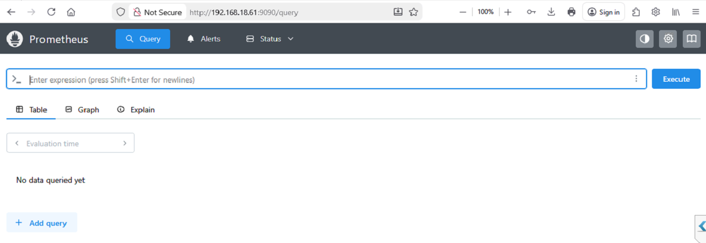
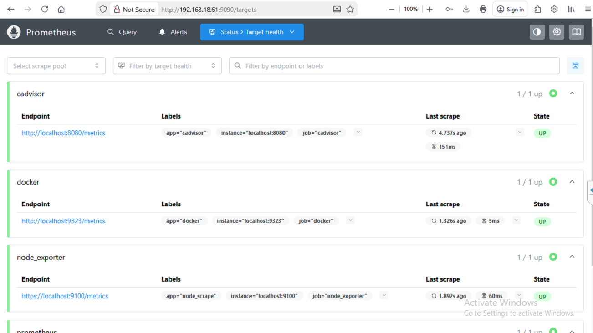

# Installing Prometheus in Linux

This guide explains how to enable install and configure Prometheus in a Linux environment.

# 1. Download and install latest Prometheus

### Copy install_prometheus.sh and execute it
```bash
chmod +x install_prometheus.sh
./install_prometheus.sh
```

This will install and configure prometheus on your machine with default values.
Further customization can be done like installing grafana, node_exporter, implementing basic auth can be found in designated directories.

# 2. Access Prometheus UI

Open in browser, change IP with your local IP.
```bash
http://192.168.18.61:9090
```



---

## Contents

- [node_exporter](node_exporter/README.md)
- [docker_cadvisor](docker_cadvisor/README.md)
- [grafana](grafana/README.md)
