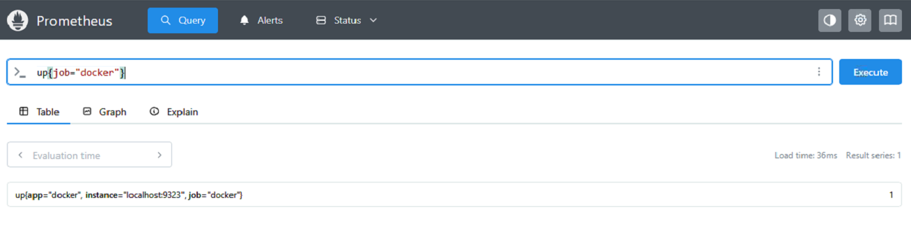
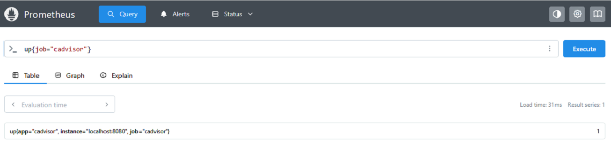

# Installing docker and cadvisor metrics

This guide explains how to install and configure docker and cadvisor metrics assuming docker is already installed.

# A: Enable Docker Engine Metrics (Optional)
Docker can expose internal engine metrics on port 9323. These metrics are not container-level, but are still useful.

### Step 1: Edit Docker Daemon

```bash
vi /etc/docker/daemon.json
```
Add this to the json file, change port if needed.

```json
{
  "metrics-addr": "127.0.0.1:9323",
  "experimental": true,
  "insecure-registries" : ["localhost:5000","external-registry:5000"]
}
```
### Step 2: Restart Docker
```bash
systemctl restart docker
```
---

# B: Install cAdvisor
cAdvisor collects container-level metrics, including:
- CPU usage
- Memory usage
- Disk I/O
- Network traffic
- Container restarts

### Step 1: Run cadvisor container

```bash
VERSION=v0.53.0 # use the latest release version from https://github.com/google/cadvisor/releases 
```
```bash
 sudo docker run --volume=/:/rootfs:ro  --volume=/var/run:/var/run:ro \
 --volume=/sys:/sys:ro --volume=/var/lib/docker/:/var/lib/docker:ro \
 --volume=/dev/disk/:/dev/disk:ro --publish=8080:8080 --detach=true \
 --name=cadvisor --privileged --device=/dev/kmsg  \
 ghcr.io/google/cadvisor:$VERSION # for versions prior to v0.53.0, use gcr.io/cadvisor/cadvisor instead
```

### Step 2: Verify cAdvisor UI
Open in browser or use curl
```bash
curl http://localhost:8080
```

# C: Configure Prometheus to scrape Docker and cAdvisor metrics

### Step 1: Add new jobs to prometheus.yml

```bash
vi /etc/prometheus/prometheus.yml
```
```yaml
  - job_name: "docker"
    static_configs:
      - targets: ["localhost:9323"]
        labels:
          app: "docker"
  - job_name: cadvisor
    static_configs:
      - targets: ["localhost:8080"]
        labels:
          app: "cadvisor"
```

### Step 2: Restart Prometheus
```bash
systemctl restart prometheus
```

### Step 3: Verify scrape status
In prometheus UI enter 
```promql
up{job="docker"}
```
```promql
up{job="cadvisor"}
```
Expected output:


